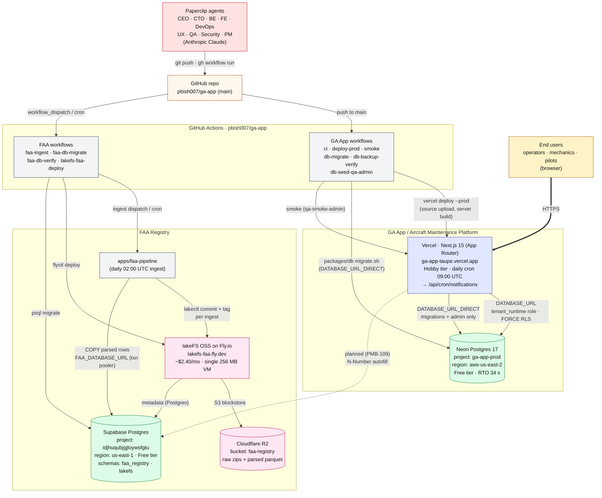

# GA Applications — Production Architecture

*Snapshot as of 2026-06-06. Source of truth for the architecture slide attached to [PMB-181](/PMB/issues/PMB-181). Update this doc when a new component goes live; don't draw aspirational state here.*

The company runs two product lines from a single monorepo (`pbish007/ga-app`):

- **GA App / Aircraft Maintenance Platform** — the customer-facing SaaS.
- **FAA Registry** — an integration-first data plane that feeds the maintenance app (and, eventually, standalone surfaces).

The two product lines share one source of truth (GitHub), one CI substrate (GitHub Actions), and one human/agent loop (Paperclip + Anthropic). They deliberately do **not** share a database: tenant data lives on Neon, FAA data lives on Supabase. That separation is the security and blast-radius story.

## Diagram

## GA App / Aircraft Maintenance Platform

Live at <https://ga-app-taupe.vercel.app>. Next.js 15 App Router under `apps/web`, deployed to Vercel Hobby. State lives in Neon Postgres (`ga-app-prod`, `aws-us-east-2`, Postgres 17). Tenant isolation is enforced by Postgres RLS (FORCE on every tenant table) with a dedicated `tenant_runtime` login role; migrations and admin endpoints run under `DATABASE_URL_DIRECT` (`authenticator` for migrations, `neondb_owner` for runtime privileges). Authentication, the demo org, and the smoke harness (`qa-smoke-admin@gaapp.io`) are all live. The Hobby tier limits us to a single daily cron — `/api/cron/notifications` at 09:00 UTC — which is enough for current MVP scope.

## FAA Registry

An integration-first back-end (no standalone UI yet). `apps/faa-pipeline` runs as a nightly GitHub Actions job (`faa-ingest`, 02:00 UTC). Each ingest writes raw FAA zips and parsed parquet to Cloudflare R2 bucket `faa-registry`, versions the write through **lakeFS OSS** (`lakefs-faa.fly.dev` on Fly.io, single 256 MB VM, ~$2.40/mo — the first paid line item on the FAA stack), and `COPY`s parsed rows into a separate Supabase project (`idjhuqubjgjloywsfgtu`, `us-east-1`) under the `faa_registry` schema. lakeFS's metadata lives on the same Supabase under the `lakefs` schema, so there is exactly one Postgres host for the FAA data plane. The maintenance app does not read from FAA yet — N-Number autofill (PMB-109) is the planned first integration.

## Cross-cutting plumbing

GitHub (`pbish007/ga-app`, `main`) is the source of truth. All deploys and DB migrations route through GitHub Actions — there is no manual `vercel`-from-laptop or `psql`-against-prod path in steady state. Two product-specific workflow families share the same runner pool. Secrets sit in two locations: Vercel project env for runtime (`DATABASE_URL`, `DATABASE_URL_DIRECT` — both `type: sensitive`, write-only), and GitHub Actions repo secrets for CI (`DATABASE_URL_DIRECT`, `FAA_DATABASE_URL`, `FAA_R2_*`, `LAKEFS_*`, `FLY_API_TOKEN`). Code review, design, ops, and execution are driven by the Paperclip agent team (CEO, CTO, BackendEngineer, FrontEndEngineer, DevOpsEngineer, UXDesigner, QA, SecurityEngineer, ProductManager) running Claude via the Paperclip control plane.

## Monthly budget envelope ($100 cap, set on PMB-149)

| Component | Tier / cost |
| --- | --- |
| Vercel (Hobby) | $0 |
| Neon Postgres (Free) | $0 |
| Supabase Postgres (Free) | $0 |
| Cloudflare R2 (Free tier) | $0 (storage well under 10 GB cap) |
| GitHub Actions (Free tier) | $0 (well under 2000 min/mo) |
| Fly.io — `lakefs-faa` | ~$2.40/mo |
| **Paid infra subtotal** | **~$2.40/mo** |
| Anthropic agent inference | variable — dominant line item |

Headroom under the $100 cap is overwhelmingly absorbed by Anthropic agent inference; the deployed infrastructure barely moves the needle. Upgrades that would change this picture: Neon Launch ($19/mo) when PITR > 7 days is needed; Vercel Pro ($20/mo) when we need hourly crons or higher build minutes; Supabase Pro ($25/mo) when the 15-client session-pool cap starts to bite the lakeFS metadata path.

## Notable cross-references

- Deploy chain history and CI gotchas: [project_deploy_chain_auth_blocker](#) (memory).
- Front door / demo org: [project_front_door_demo](#) (memory).
- FAA Registry scope and decomposition: [project_faa_registry](#) (memory), [PMB-99](/PMB/issues/PMB-99).
- Neon RTO drill and DB role topology: `docs/runbooks/postgres-restore.md`, [reference_neon_production](#) (memory).
- lakeFS constraints and runbook: `infra/lakefs-faa/README.md`, [reference_lakefs_faa_deployment](#) (memory).
